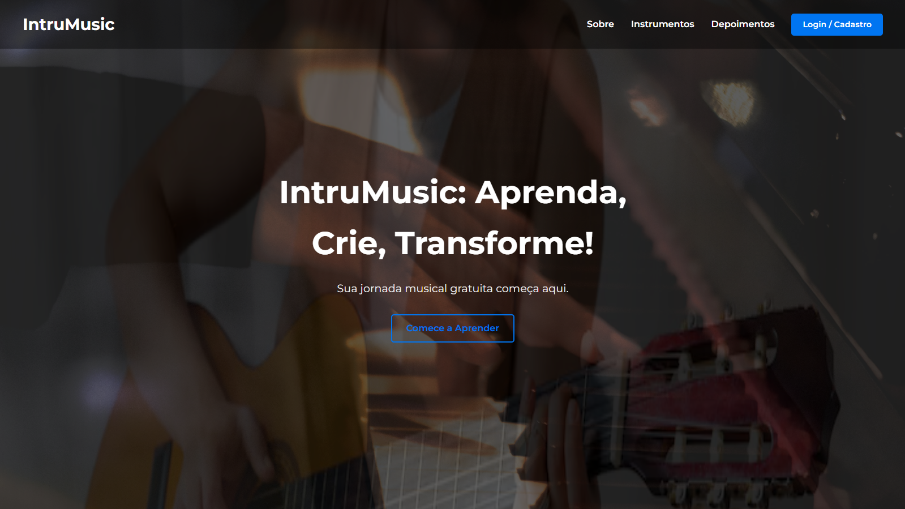

# Instrumusic

Nosso site é focado em ajudar as pessoas a tocar qualquer instrumento musical. Você escolhe o seu estilo e instrumento. Tudo é totalmente gratuito! Dentro da plataforma, você pode selecionar o horário em que deseja aprender e o local disponível para o aprendizado.

## 🚀 Como rodar o projeto

Para rodar o site Instrumusic, Instale o Live server(extensão do vscode)

## 🤝 Colaboradores

Pessoas que colaboraram para a criação do site:

<table>
  <tr>
    <td align="center">
      <a href="https://github.com/07victorsz" title="Link do github do Victor">
         
        
          <b>Victor</b>
        
      </a>
    </td>
    <td align="center">
      <a href="https://github.com/henriquevieiraneto" title="Link do github do Henrique">
         
        
          <b>Henrique</b>
        
      </a>
    </td>
    <td align="center">
      <a href="https://github.com/Ettham" title="Link do github do Victor">
         
        
          <b>Ettham</b>
        
      </a>
    </td>
    <td align="center">
      <a href="https://github.com/Carati32" title="Link do github do Bruno">
         
        
          <b>Bruno</b>
        
      </a>
    </td>
  </tr>
</table>

## 📝 Licença

Esse projeto está sob licença. Veja o arquivo [LICENÇA](LICENSE) para mais detalhes.