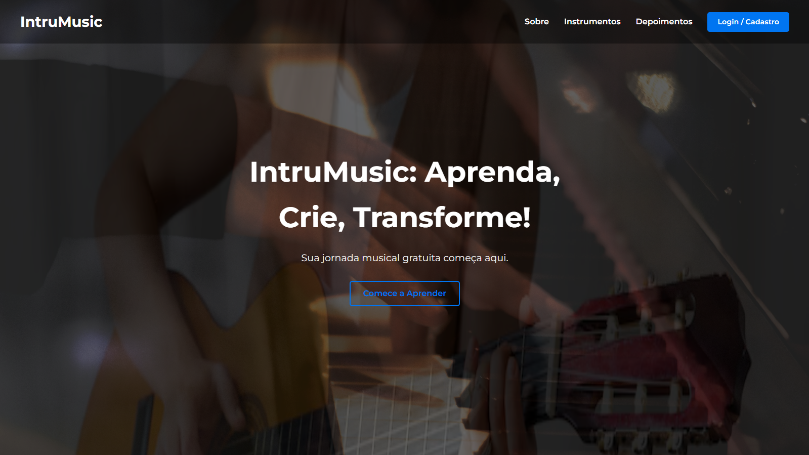
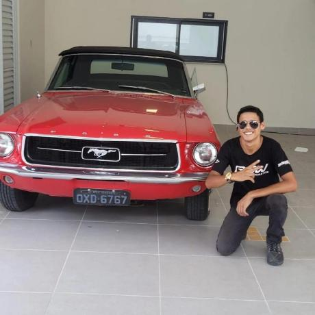

# Instrumusic

 Nosso site se baseia em ajudar as pessoas a tocar qualquer instrumento musical voce quem escolhe seu estilo e seu instrumento é totalmente gratuito dentro do nosso site voce pode escolher o horario em que voce deseja aprender a tocar seu instrumento e o local disponivel para aprendizado. 

## 🚀 Como rodar o projeto <Instrumusic>

Para rodar o <Instrumusic>, Instale o Live server(extensão do vscode)

:

## 🤝 Colaboradores

Pessoas que colaboraram para a criação do site:

<table>
  <tr>
    <td align="center">
      <a href="https://github.com/07victorsz" title="Link do github do Victor">
         
        
          <b>Victor</b>
        
      </a>
    </td>
    <td align="center">
      <a href="https://github.com/henriquevieiraneto" title="Link do github do Henrique">
         
        
          <b>Henrique</b>
        
      </a>
    </td>
    <td align="center">
      <a href="https://github.com/07victorsz" title="Link do github do Victor">
         
        
          <b>Ettham</b>
        
      </a>
    </td>
    <td align="center">
      <a href="https://github.com/Carati32" title="Link do github do Bruno">
         
        
          <b>Bruno</b>
        
      </a>
    </td>
  </tr>
</table>
## 📝 Licença

Esse projeto está sob licença. Veja o arquivo [LICENÇA](LICENSE.md) para mais detalhes.
   